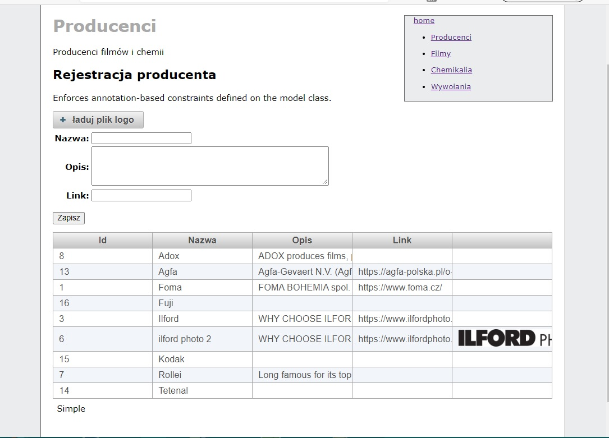
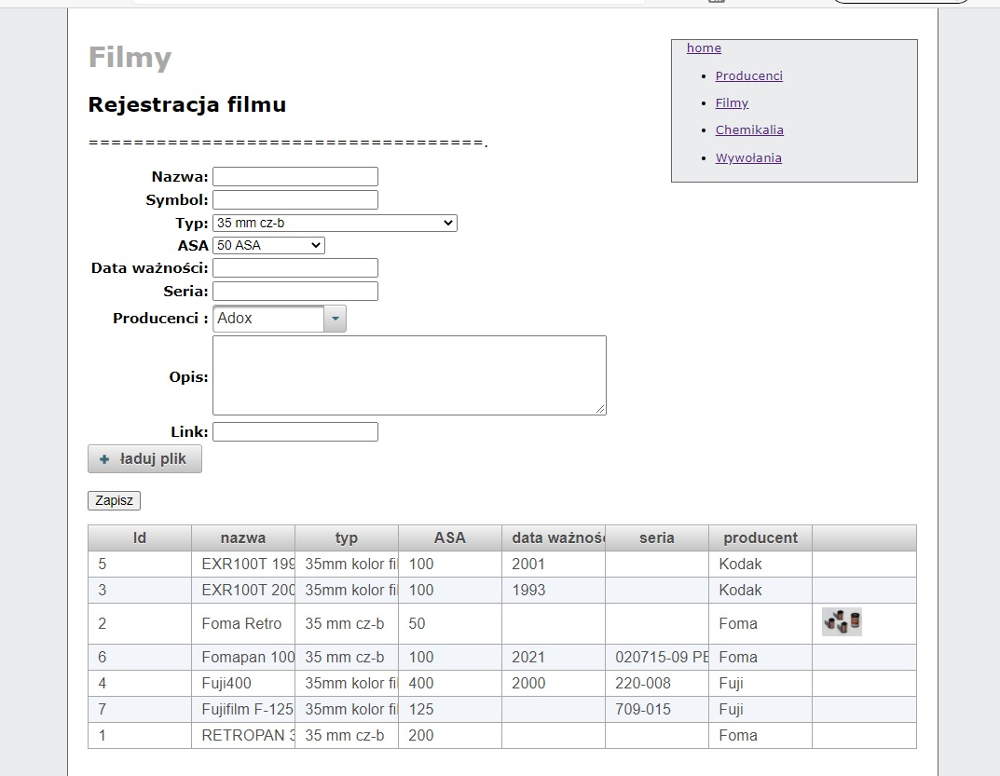

# fotolab

Projekt testowy służy do sprawdzenia możliwości wykonania apikacji do zarządzania wywołaniami analogowych fimów fotograficznych.
W załozeniu projekt ma dostarczyć informacji o  możliwósci wykonania aplikacji w technologii Javy oraz umozliwić oszacowanie nakładu pracy i porównanie tego nakładu z technologią REST - React.

## technologie
Technologie użyte w projekcie:
Java EE6, serwer Jboss (Wildfly 17), Hibernate, JSF, (Primefaces)

## interfejs użytkownika

