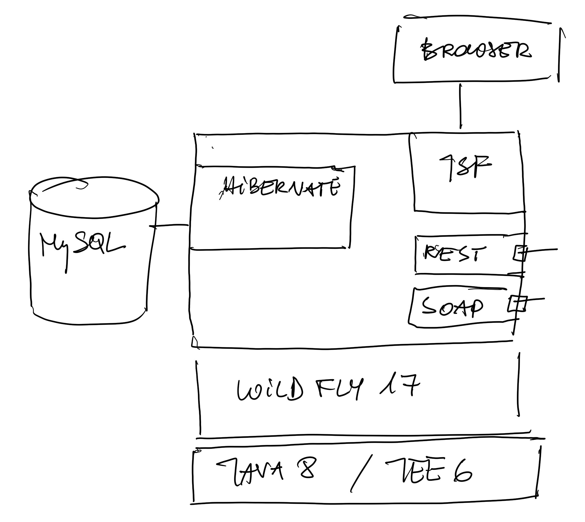

# fotolab

Projekt testowy służy do sprawdzenia możliwości wykonania apikacji do zarządzania wywołaniami analogowych fimów fotograficznych.
W załozeniu projekt ma dostarczyć informacji o  możliwósci wykonania aplikacji w technologii Javy oraz umozliwić oszacowanie nakładu pracy i porównanie tego nakładu z technologią REST - React.

## technologie
Technologie użyte w projekcie:
Java EE6, serwer Jboss (Wildfly 17), Hibernate, MySQL, JSF, (Primefaces)

### pliki dodatkowe
w katalogu .settings znajduje sie pik stanf=dalone.xml który zawiera przykładową konfiguracje serwera jboss wraz s połaczeniem do bazy danych

w katalogu .settings/sql-data znajdują się skrypty do tworzenia bazy danych

## szkic architektury

## interfejs użytkownika

